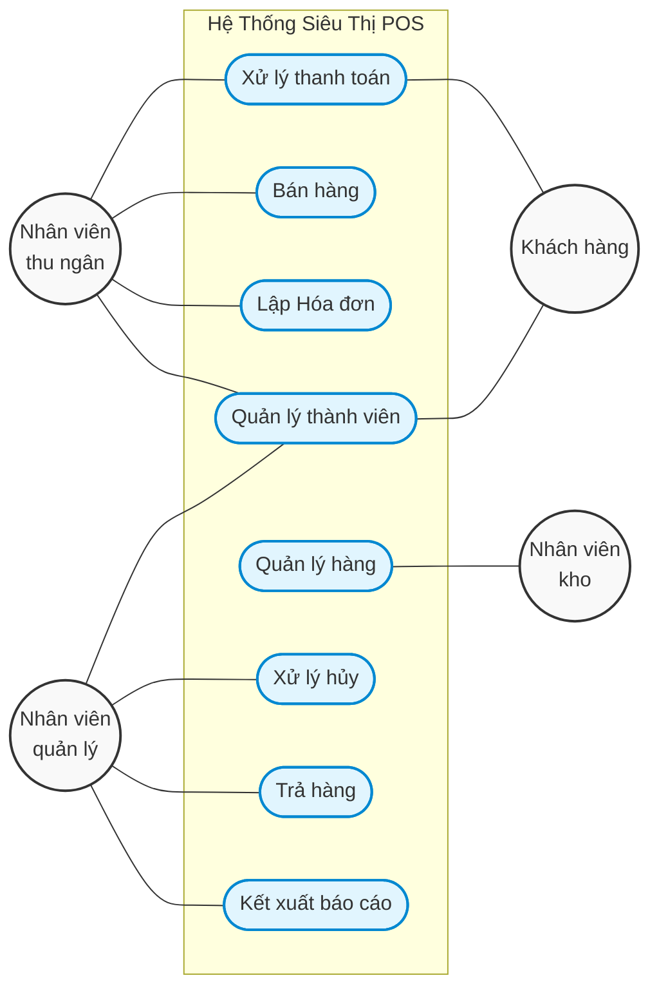
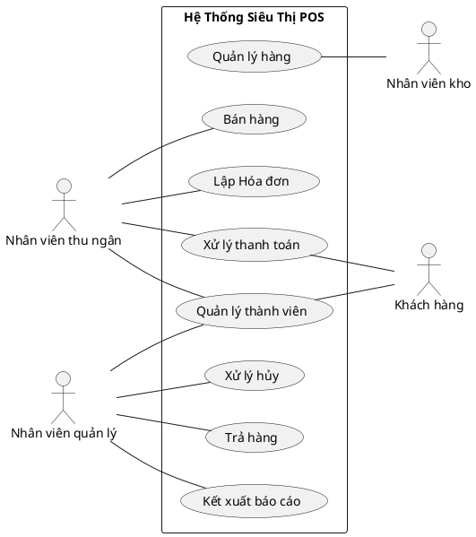

# Sơ đồ Use Case Diagram tổng quan

Dưới đây là sơ đồ Use Case tổng quan được vẽ lại từ hình ảnh trong tài liệu của bạn. Mình cung cấp cho bạn 2 định dạng phổ biến nhất là **Mermaid** (có thể xem trực tiếp trên GitHub/Notion/Markdown) và **PlantUML** (chuyên dụng để vẽ biểu đồ UML chuẩn với hình người).

### 1. Sơ đồ Mermaid
Bạn có thể copy đoạn code này dán vào bất kỳ trình soạn thảo Markdown nào có hỗ trợ Mermaid (như GitHub, Notion, Obsidian,...) để hiển thị.

### 2. Định dạng PlantUML (Đề xuất)
PlantUML là chuẩn phổ biến nhất để vẽ Use Case, nó sẽ vẽ ra hình các "người que" (stickman) và khung hệ thống hoàn hảo giống hệt trong file Word của bạn. Bạn có thể dán code dưới đây vào trang web [PlantText](https://www.planttext.com/) hoặc [PlantUML Web](https://www.plantuml.com/plantuml/uml/) để xuất ra hình ảnh nhé:

### 📋 Phân tích các quyền hạn (Actor - Use Case)
Theo bản vẽ của bạn, hệ thống được cấu trúc tương tác như sau:

*   **Nhân viên thu ngân** tham gia vào 4 chức năng: *Bán hàng, Lập Hóa đơn, Xử lý thanh toán, Quản lý thành viên*.
*   **Nhân viên quản lý** tham gia vào 4 chức năng: *Quản lý thành viên, Xử lý hủy, Trả hàng, Kết xuất báo cáo*.
*   **Nhân viên kho** chỉ tham gia vào 1 chức năng: *Quản lý hàng*.
*   **Khách hàng** tham gia vào 2 chức năng: *Xử lý thanh toán, Quản lý thành viên*.
